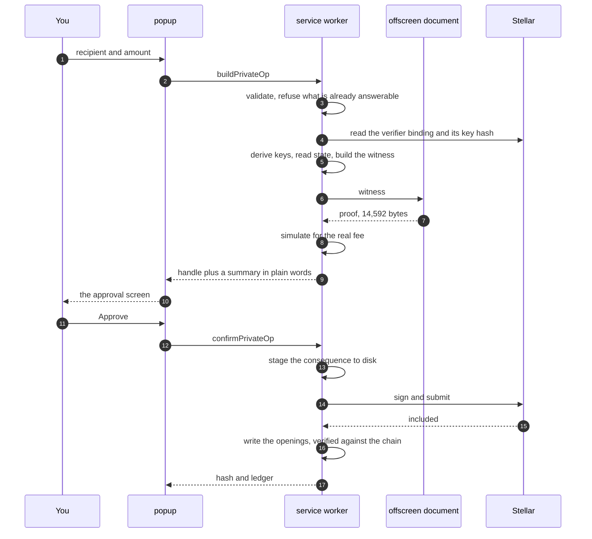

This is the spine of the architecture. Follow one confidential transfer end to end and you have seen every layer in the system doing its job.

The example: you send 10 XLM privately from your private pocket.



## Phase 1: the popup asks

You fill in a recipient and an amount and press **Continue**.

The popup holds no keys and builds no transactions. It sends one typed message to the service worker and waits:

```ts
call({ type: "buildPrivateOp", op: { kind: "transfer", to, amount }, asset })
```

That is the entire interface between the two. [The message contract](/docs/how-it-works/message-contract-and-dispatch).

## Phase 2: the worker checks who is asking

The service worker's message listener runs three checks before anything else happens.

The sender must be this extension. It must be one of the extension's **own pages**, not a content script, which carries the same extension id while running inside a hostile web page. And the wallet must be unlocked, unless the message is one of the six that carry their own authorisation.

The router then validates the shape of the request. The type union describes what the popup is supposed to send and erases at runtime, so the router checks that the amount is a string and the operation kind is one of the five it knows, and names the problem here rather than letting an absent field surface three layers down.

## Phase 3: refusals that cost nothing

Before any slow work, the controller refuses anything it can already answer:

| Check | Why here |
| --- | --- |
| Nothing else is unresolved | A second transaction would take the sequence number the first was built against |
| The amount is above zero | A zero-amount operation costs a fee and a proof to change nothing |
| The recipient is a `G` address | A contract address cannot hold a confidential account |
| The recipient is not you | Sending privately to yourself is a merge run backwards, and costs a fee to make you worse off |

These run **ahead of** the verification-key check and the circuit load, because neither of those can rescue a request that is refused on its face, and both make you wait to be told so.

## Phase 4: is this deployment the one the proof is for

Two reads, and both fail closed.

**Which verifier does the token use?** The token binds its verifier at construction and exposes no getter, but instance storage is public ledger state, so Pocket reads the binding directly and compares it against the verifier its own config names.

**Does that verifier hold the key the proof will be checked against?** Pocket simulates `get_verification_key` for the `transfer` circuit, hashes the result, and compares against a hash pinned in the build.

Without the first check, the second proves only that a contract Pocket's own config names holds a hash Pocket's own build pins: two values chosen by the same party, agreeing with each other, saying nothing about the deployment.

An unreadable answer is treated as a mismatch. The point is to refuse to build a proof whose verification key could not be confirmed.

## Phase 5: keys, from your phrase

The confidential spending key is derived on demand and never stored.

<Steps>

<Step>
### A signer root

Pocket signs a 151-byte message naming the protocol, the wrapper contract and your account, using your Stellar key, under SEP-0053.

It then **verifies that signature against the public key it expects**. A signature from a different account is well-formed and yields a wrong but entirely usable spending key, and registration is single-use, so that mistake is unrepairable.
</Step>

<Step>
### HKDF, with rejection sampling

`sk = HKDF-SHA-512(root, salt, info)`, masked to 254 bits, rejected and redrawn if it lands at or above the field modulus.

About 24% of draws are rejected, which is why the loop matters and why the byte order inside `info` is worth getting right: the two field elements are big-endian and the rejection counter is little-endian, in the same buffer.
</Step>

<Step>
### The viewing key

`vk = Poseidon2(δ_vk, sk, addr_f)`, where `addr_f` is the wrapper's own address compressed to a field element.

Because the wrapper address is baked in, each deployment gives you a different confidential identity. That is why private XLM and private USDC are separate accounts.
</Step>

</Steps>

[The full derivation](/docs/protocol/key-derivation).

## Phase 6: read the chain state the proof must match

Four reads, all by simulation, none of which change anything:

- your own confidential account, for the commitment your proof has to open
- the recipient's confidential account, for their public viewing key
- your auditor's registered key
- the recipient's auditor's registered key

If the recipient has no confidential account for this asset, Pocket stops here and says so, rather than building a transfer that cannot land.

## Phase 7: build the witness

A fresh salt is **sampled** for this attempt. Not derived: the salt is the only freshness input to every pad in the operation, so reusing one would repeat the ephemeral key and every channel mask.

The witness builder then computes everything the circuit will check, and refuses at its own boundary if any of it is inconsistent. The most important refusal is this one:

```
the stored opening does not match the on-chain spendable commitment;
re-sync before spending
```

That fires when your local `(v, r)` does not open the commitment the contract holds. Proving against it would produce a proof that fails at the verifier with no useful diagnostic.

The output is three things: the **public inputs** in exactly the order the contract will reassemble them, the **private inputs**, and the **payload** that gets published alongside the proof.

Ordering is not negotiable. A permutation of two same-typed inputs is a well-formed vector that verifies a *different statement*. [Witness and public inputs](/docs/protocol/witness-and-public-inputs).

## Phase 8: prove

The circuit is loaded from the extension package, never the network, and its bytecode is decompressed on the way in.

**Solving** turns named inputs into the ordered witness the prover consumes. It is also a free correctness check: the circuit refuses an assignment that does not satisfy its constraints, so a bad witness fails here rather than producing a proof that fails on chain.

The solved witness goes to the **offscreen document**, which is the only extension context that can both spawn a Worker and reach cross-origin isolation. It is also the most sensitive message in the system: for a transfer it contains the spending key, the amount and the blinding. The offscreen document checks its sender for exactly that reason.

The prover returns `publicInputs || proof` concatenated. Pocket splits them at the circuit's known slot count and asserts the proof is **14,592 bytes**, because the contract takes the two separately and would reject a proof carrying its inputs glued to the front.

[The proving pipeline](/docs/how-it-works/proving-pipeline).

## Phase 9: encode and simulate

The payload and the proof are encoded into the single `Bytes` argument the contract entry point takes: a Soroban map with symbol keys, **sorted**, because Soroban requires sorted map keys and rejects anything else with an error that gives no hint about ordering.

The transaction is then **simulated before you are shown anything**. A Soroban envelope leaves the builder carrying only the base fee, and simulation is what rewrites it to include the resource fee. Simulating here is what makes the fee on the review the fee that gets signed.

## Phase 10: you review

The worker returns a handle and a summary. The handle names an envelope the worker built and **retained**; the popup never sees or sends raw transaction bytes.

That is what makes the review meaningful. Without it the worker would sign whatever bytes it was handed, and the approval screen would be decoration.

The summary carries the amount, the recipient in full, the real fee, and every consequence in words. [Never blind-sign](/docs/security/never-blind-sign).

## Phase 11: sign and submit

You approve. The worker re-decodes its own retained envelope, re-asserts that it is not a fee bump and that its source is your account, and then:

<Steps>

<Step>
### Simulate again, and refuse an undecidable expiry

Preparing twice is safe: the SDK subtracts any resource fee already on the envelope before adding the simulated one.

The envelope must carry a decidable expiry. Without one, a stuck transaction could never be reported expired, every later build would be refused forever, and the only exit would be erasing the wallet.
</Step>

<Step>
### Stage the consequence to disk, before submitting

This is the step that protects your money.

Between submission and the write that records what it did sit a confirmation poll of several seconds and a chain read, and Chrome will evict the service worker inside that window without warning. Held only in memory, a transfer's new opening dies there while the chain moves on, and no opening means a balance visible on chain and spendable by nobody.

So the consequence is written to disk first, encrypted, because it carries an amount and is exactly as sensitive as a key.
</Step>

<Step>
### Record the hash, then send

The in-flight record is written **before** `sendTransaction`. If the worker dies between the two, the hash is still on disk and can be polled rather than blindly resent.
</Step>

<Step>
### Poll to a terminal outcome

Six outcomes, and conflating any two of them loses money or double-spends. [Submitting and settling](/docs/how-it-works/submitting-and-settling).
</Step>

</Steps>

## Phase 12: write the opening, then clear the record

On success, the staged consequence is applied to whatever is stored **now**, not to a snapshot taken before submission.

That matters: proving takes seconds, and a payment arriving in that window is ordinary. A transfer's staged post-state therefore says only what its own operation changed (the spendable side) and stays silent about the receiving side, which the contract does not touch on a transfer at all.

The result is then **verified against the chain** before it is trusted. Pocket re-reads your confidential account, re-commits the computed openings, and compares. A mismatch is reported and the record is kept, so you are brought back to it rather than told everything is fine.

Only after the write succeeds is the in-flight record cleared. The order is the whole point: the record is the only thing that leads a later worker back to the staged opening, so clearing it first would strand a landed operation with its consequence unwritten.

## What the recipient does

Nothing, until their wallet looks.

Their next balance read scans the RPC's retained event window for transfers and deposits addressed to them, derives a candidate opening for each from their own viewing key, and credits the batch **only if** the sum reproduces the receiving commitment the contract now holds.

All or nothing, deliberately. Crediting a subset would leave a balance that looks right and cannot be spent, which is worse than crediting none: the proof would fail at submission with the funds apparently present.

[Reading the chain](/docs/how-it-works/reading-the-chain).
