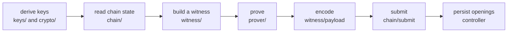

Everything under `extension/src/core/` sits at exactly one level, and each level has a rule about what it may reach for.

```
crypto/          deterministic, no I/O, no state
keys/            deterministic, no I/O
witness/         deterministic given randomness
prover/          I/O, pluggable backend
chain/           I/O
controller.ts    stateful facade
```

**Nothing below the prover may reach for the network or for storage.** That is what makes the cryptography testable without either, and what makes the layering checkable rather than aspirational.

## crypto

Field arithmetic, the curve, the hash, and the domain tags. No state, no I/O, no dependencies on anything above it.

| Module | What it owns |
| --- | --- |
| `field.ts` | the two moduli, and the only canonical 32-byte encodings |
| `grumpkin.ts` | the curve, the generators, commitments, ECDH |
| `poseidon.ts` | the protocol's sponge, which is not a general-purpose hash |
| `domain.ts` | the sixteen domain separation tags |
| `address.ts` | compressing a Stellar address to a field element |
| `derive.ts` | every derivation above the spending key |

The one rule that governs this whole directory: there are **two moduli**, they agree in their top 17 hex digits, and confusing them silently corrupts balances. `addModR` and `addModQ` are separate named functions, and there is no bare bigint arithmetic anywhere above this layer. [Protocol invariants](/docs/protocol/invariants).

## keys

Derivation from your recovery phrase to the keys each pocket needs. Deterministic, and still no I/O.

| Module | What it owns |
| --- | --- |
| `sep5.ts` | the public pocket: SLIP-0010 ed25519 on `m/44'/148'/N'` |
| `root.ts` | the SEP-0053 signer root that seeds the confidential key |
| `sk.ts` | the confidential spending key, by HKDF with rejection sampling |
| `auditor.ts` | the self-auditor key, from its own signer root |

[Key derivation](/docs/protocol/key-derivation).

## witness

Turning state into the vector a circuit takes. Deterministic given the salt, which the caller supplies.

Freshness is owned by the **caller**, not by the builders. Each builder takes `sigma` as an input and cannot know whether it is new, so exporting the builders without the sampler would hand a consumer the operations and withhold the safety-critical input all of them need.

Every builder validates at its own boundary rather than deferring to the contract. A client that produces non-canonical bytes has already lost byte-uniqueness in the local state that recovery reads from, and the diagnosis would land three layers from the cause.

## prover

The proving backend, behind an interface. The service-worker half owns the offscreen document's lifecycle and its deadlines; the offscreen half owns the queue and the wasm.

The layer is pluggable on purpose: `CircuitSource` is an interface with two methods, so the circuits can come from the package in production and from disk in a test.

[The proving pipeline](/docs/how-it-works/proving-pipeline).

## chain

Everything that talks to Stellar. Reads, submission, fee and reserve arithmetic, prices, history, TTLs, the archive client.

Two disciplines run through all of it:

**Distinguish "absent" from "unanswered".** The SDK's parsed accessors turn a reply with a missing field into an empty array, which is byte-identical to "there is nothing here". Pocket reads the raw responses where that distinction decides what a user is told. [Reading the chain](/docs/how-it-works/reading-the-chain).

**Never render an amount from an answer that was not verified.** In a wallet, a confident wrong number is the worst available bug: an error on screen costs a reload, and a fabricated balance gets acted on.

## controller.ts

The stateful facade the router calls. It owns the vault, the session, the pending envelopes, the staged consequences, and the queue.

One rule dominates it: **everything that builds against a sequence number, signs, submits, or writes openings runs one at a time**, through a single promise chain.

Nothing here has a single caller. The popup and the keep-alive alarm are independent, and two submissions overlapping share one account sequence and one in-flight record. Interleaved, one transaction fails with a bad sequence number and the other's in-flight record is erased by its neighbour's terminal outcome, which is exactly the record the unfinished-transaction screen exists to find.

## Where a private operation crosses every layer

`confidential-ops.ts` is the seam. It is the one module that legitimately touches all six levels, because a private operation genuinely needs all of them:



Reading that file top to bottom is the shortest route to understanding how the private pocket works. [The walkthrough](/docs/how-it-works/anatomy-of-a-confidential-operation).
