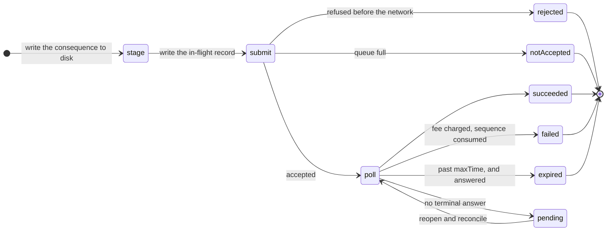

This is the path where a wrong answer costs money rather than a reload.

## Six outcomes, none interchangeable

| Outcome | Included | Fee | Sequence number | What to do |
| --- | --- | --- | --- | --- |
| `rejected` | never | none | not consumed | build again |
| `notAccepted` | never | none | not consumed | wait a few seconds, retry |
| `pending` | **unknown** | unknown | unknown | **do not resend.** Poll the hash |
| `succeeded` | yes | charged | consumed | done |
| `failed` | yes | **charged** | **consumed** | build again, knowing it cost a fee |
| `expired` | never, and never can be | none | not consumed | safe to rebuild |

Conflating any two of these loses money or double-spends. `notAccepted` reported as `pending` would strand you for a whole time-bounds window on a transaction that never entered the network. `failed` reported as "did not land" would be the opposite of what happened, on the one screen you opened to find out.

## The idempotency rule

**Never blind-resubmit after a timeout.**

The transaction hash is computable locally before submission, so the correct move is always to poll by hash. Rebuilding is only safe once the time bounds have expired, which is what makes time bounds mandatory rather than optional.

Pocket refuses to submit an envelope whose expiry it cannot decide. An envelope with `maxTime: 0` has no upper bound: it can be included at any time, so it can never be reported expired, every later build would be refused forever, and the only exit would be erasing the wallet, which is the one action that destroys the confidential openings.

That is not hypothetical. A live DeFindex deposit envelope carries `timeBounds: {minTime: "0", maxTime: "0"}`, so foreign envelopes are rebound to Pocket's own 180-second window before they are hashed or stored.

## "Pending" has two meanings, and they are not the same

`pollToTerminal` reports `pending` when it never reached a terminal state. That covers two situations that look identical and are not:

| | |
| --- | --- |
| The RPC replied **not found** | real evidence: at this moment the ledger does not have it |
| No poll got through at all | evidence of nothing, and in particular **not** evidence that it did not land |

The outcome carries an `answered` flag to separate them, and it decides whether the expiry of `maxTime` is safe to act on.

Without it, a network outage spanning a three-minute window read as "expired, can never apply", and the staged consequence of a transaction that may well have **succeeded** was deleted on that reading.

An envelope past its `maxTime` can never apply **from now on**, which says nothing whatever about whether it applied earlier. Only the ledger having answered rules that out.

## The in-flight record

One durable record, written to disk, naming the transaction Pocket is waiting on.

**It is written before submission.** If the worker dies between writing it and the reply, the hash is still on disk and can be polled rather than blindly resent.

Both writing and clearing it are hash-guarded and happen in one place. That symmetry is load-bearing: without it, a second submission could erase the pointer to a first one that had already landed, and on a confidential operation that record is the only thing that leads a later worker back to the opening it produced.

A keep-alive resolving beside a payment must not erase the payment's record, so a clear only ever removes its own hash.

## Nothing is built while something is unresolved

The build gate refuses whenever a previous submission is still open and still inside its time bounds.

Two transactions in flight at once share one account sequence number. Whichever lands first, the other is destroyed, and you paid a fee for both.

The gate has to sit at **build** time, because the unfinished-transaction screen only appears when the popup mounts, so a popup left open after a timeout would otherwise walk straight back into composing a second payment. A second, narrower guard sits at the submission sink as a backstop, because the build-time check cannot see a submission that starts while it is running.

There is no exemption, including for a merge. A merge consumes a sequence number like anything else, and an unresolved merge is one whose outcome is **unknown** rather than one known to have failed. The gate already returns early once the earlier envelope's time bounds have passed, which is exactly when a second attempt becomes safe, so any exemption narrow enough to be correct is one the gate already grants.

## Staged consequences

A public payment settles the moment the ledger answers: the ledger's answer is the whole outcome.

A **confidential** operation does not. It produces a new opening that only your device will ever hold, and writing it is a separate step from the ledger accepting the transaction.

So the consequence is staged to disk, encrypted under the vault key, **before** submission. Between `sendTransaction` and the write sit a confirmation poll of several seconds and a chain read, and Chrome will evict the worker inside that window without warning. Held only in memory, a transfer's new opening dies there while the chain moves on.

Four kinds of staged consequence, each expressed so it can survive to disk:

| Kind | Records | Used by |
| --- | --- | --- |
| `openings` | the whole post-state, absolutely | register |
| `spend` | the new spendable opening, and nothing else | transfer, unshield |
| `credit` | an amount to add to the receiving side | shield |
| `merge` | fold receiving into spendable | merge |

### Why `spend` says nothing about the receiving side

Because the contract does not touch it. Neither `confidential_transfer` nor `withdraw` writes the sender's receiving commitment, so the only thing that moves it is somebody else paying you, which needs no transaction of yours and no permission.

Proving takes seconds. A payment arriving in that window is ordinary. Recording an absolute post-state that included the receiving side as it was read at **build** time made the staged state wrong about a side the operation never changed, so the chain check refused and the pocket sat in a diverged state after an operation that had **succeeded**.

So the post-state is absolute exactly where it has to be, because the new spendable opening comes out of the proof and cannot be recomputed, and silent everywhere else.

### Resolution order

On success, and only on success:

<Steps>

<Step>
### Apply the staged consequence to what is stored now

Relative where it can be, so it resolves against current storage rather than a snapshot taken before submission.
</Step>

<Step>
### Verify against the chain

Re-read the confidential account, re-commit the computed openings, compare. A mismatch throws and the staged record survives, so a failed chain read leaves the opening recoverable rather than discarding the only copy that exists.
</Step>

<Step>
### Write the openings
</Step>

<Step>
### Clear the in-flight record

Last, deliberately. The record is the only thing `reconcileInFlight` reads, so clearing it before the write could fail would strand a landed operation with its consequence unwritten.
</Step>

</Steps>

Every resolution kind is idempotent under the chain check, which is what makes replaying one after a crash safe. A merge applied twice folds an already-empty receiving side and changes nothing; a credit applied twice produces a commitment the contract does not hold and is refused rather than written.

## Reconciling after a crash

`reconcileInFlight` is the other half of the crash story. It polls the recorded hash and, on success, finishes the write against the commitment the contract now holds.

A mismatch throws, and must: a wrong opening is indistinguishable from a lost one later, so the record stays put and you are brought back to it rather than told everything is fine.

An unanswered poll stays `pending`. Unresolved is the accurate report, and the next poll that gets through resolves it.

## Retrying, and what may be retried

Registering an auditor key contends: the id comes from a monotonic counter in shared storage, so two accounts registering at once touch the same ledger entry and Soroban fails the loser rather than serialising it. A failed register writes nothing, so retrying is safe.

But only for outcomes **known to have consumed nothing**: `failed`, `rejected`, `notAccepted`, `expired`. `pending` is not one of them, and resending it would be exactly the double-submission the in-flight machinery exists to prevent.

That is not an exotic case: an RPC that stops answering inside the polling window produces it. Unguarded, a resend loop lands one registration per attempt, allocates a registry id for each, records none of them, and reports that nothing was bound.
