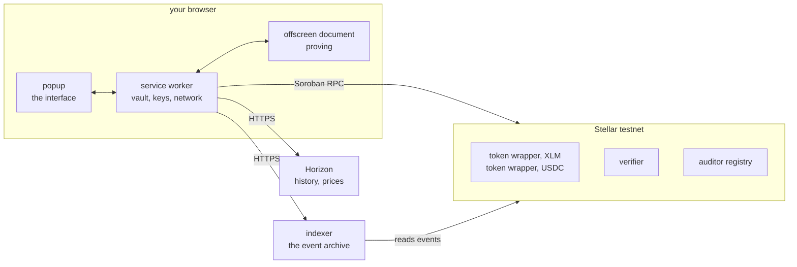

Pocket is four workspaces. Only one of them runs on your machine.



## Inside the extension

Three processes, and the split is forced by the platform rather than chosen.

| Process | Holds | Why it is separate |
| --- | --- | --- |
| **service worker** | the encrypted vault, the unlocked session, every network call, every transaction it builds | keys never enter a page, and the worker dying drops them, which turns worker death into an automatic lock instead of a bug |
| **offscreen document** | the UltraHonk prover | `bb.js` always spawns a Worker, and a Manifest V3 service worker cannot nest workers, so proving could never have lived in the worker |
| **popup** | the interface, and no keys | it talks to the worker over one typed message contract and nothing else |

A fourth piece, the content script, runs inside ordinary web pages to relay SEP-43 calls. Those pages are not under Pocket's control, so it holds nothing worth taking: it validates a message shape, forwards it, and posts the answer back. No keys, no decisions.

[The three processes in detail](/docs/how-it-works/three-processes).

## What talks to what

**The wallet reads chain state from Soroban RPC.** Balances, confidential account state, verification keys, ledger TTLs and recent events all come from `getLedgerEntries`, `simulateTransaction` and `getEvents`.

**The wallet reads history and prices from Horizon.** Two different hosts doing two different jobs: testnet Horizon knows what *your account* has held over time, and mainnet Horizon knows what *an asset* has been worth. Testnet has no real market, so a testnet price would be noise from a handful of test trades.

**The wallet reads confidential history from the archive.** Three read routes, and nothing that writes:

```
GET /v1/health?contract_id=C…
GET /v1/tokens/{contract}/accounts/{account}/events
GET /v1/tokens/{contract}/accounts/{account}/checkpoint
```

**The archive reads from both Soroban RPC and Horizon.** RPC supplies the events. Horizon supplies the invocation payload that transfer events do not carry, which is the thing that makes a *received* payment recoverable at all. [Why that is needed](/docs/how-it-works/the-archive/why-it-exists).

## What the extension is allowed to reach

The manifest declares four permissions and three hosts.

| Permission | What it is for |
| --- | --- |
| `storage` | the encrypted vault and the opening store |
| `alarms` | the idle lock, which must survive the worker being evicted |
| `offscreen` | hosting the prover in an isolated document |
| `unlimitedStorage` | the opening store grows with inbound events and must never be evicted |

| Host | What it is for |
| --- | --- |
| `soroban-testnet.stellar.org/*` | all chain reads and every submission |
| `horizon-testnet.stellar.org/*` | your account's transaction history and balance history |
| `horizon.stellar.org/trade_aggregations*` | asset prices, path-scoped to one read-only endpoint |

The mainnet entry is scoped to a single path deliberately. Horizon accepts `POST /transactions`, so a broad `horizon.stellar.org/*` grant would hand a future edit a way to submit a real mainnet transaction. A match pattern includes its path, so the grant covers `/trade_aggregations` and nothing else on that host.

There is no `tabs` permission, no clipboard permission, no history and no bookmarks.

## The layering inside the core

Every module under `extension/src/core/` sits at one level, and nothing below the prover may reach for the network or for storage.

```
crypto/          deterministic, no I/O, no state
keys/            deterministic, no I/O
witness/         deterministic given randomness
prover/          I/O, pluggable backend
chain/           I/O
controller.ts    stateful facade
```

[What lives at each level](/docs/how-it-works/core-layering).
