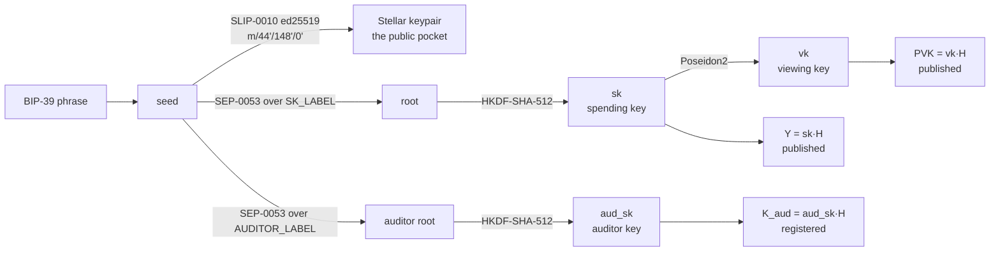

One recovery phrase produces four keys per confidential asset. Every derivation here is deterministic and none of the confidential keys is ever stored: they are re-derived on demand.



## The public pocket

Standard SEP-0005: BIP-39 phrase to seed, then SLIP-0010 ed25519 to `m/44'/148'/N'`.

Every level is hardened, which SLIP-0010 requires for ed25519: there is no public-parent to public-child derivation on a twisted Edwards curve, so non-hardened derivation is not defined at all.

Pocket derives account index 0. The account index is validated into `[0, 2³¹)`, because without that check index 0 and index 2³¹ would alias to the same key and a negative index would wrap silently to some other account.

The test vectors are SEP-0005's own rather than generated. A silent change to this derivation orphans every user's funds.

## The confidential spending key

<Callout type="warn" title="This derivation is normative, not a choice">
Two clients given the same backup material must land on the same confidential account, because `register` is single-use and a disagreement is unrepairable. A non-conformant derivation produces an account that no other wallet can ever open.
</Callout>

### The signer root

The root is a **SEP-0053 signature**, not the seed and not a BIP-32 child key:

```
msg  = SK_LABEL ‖ 0x0a ‖ enc(contract) ‖ 0x0a ‖ enc(account)     151 bytes
root = Ed25519-Sign(sk_ed, SHA-256("Stellar Signed Message:\n" ‖ msg))
```

Both addresses go into the **message**, not only into the key-derivation info. That bounds a harvested signature: a site that tricks you into signing once gets the root for that account on that deployment, not for every account the key controls everywhere.

The SEP-0053 envelope is mandatory even though Pocket holds the raw secret. A client must compute this signature rather than use the secret's 32 bytes directly, so one form covers both custody shapes.

**The signature is verified before it is used.** A wallet with a different account selected returns a well-formed signature over the same message, yielding a wrong but entirely usable spending key. Registration then succeeds and the account is unreproducible from the key you believe controls it.

### The key itself

```
sk = RS( HKDF-SHA-512( IKM  = root,
                       salt = "openzeppelin/confidential-token/v1/sk",
                       info = be32(addr_f) ‖ be32(acct_f) ‖ le4(j) ) )
```

`RS` is rejection sampling. Each draw is masked to 254 bits by clearing the top two bits, and rejected if it lands at or above the field modulus, if it is zero, or if the viewing key it produces would be zero.

About **24%** of draws are rejected, so the loop is not decorative. Its bound is 64 iterations, which makes exhausting it a roughly 2⁻¹³⁰ event.

<Callout type="warn" title="The byte-order trap">
Inside one `info` buffer, the two field elements are **big-endian** and the rejection counter is **little-endian**.

`le4(0)` is symmetric, so a client that got this wrong would agree with a correct one on every first draw and diverge only on a rejection, which happens about 24% of the time.
</Callout>

The root must be either 64 bytes (a SEP-0053 signature) or 32 bytes (a raw root, for a contract address or a signer with no SEP-0053 path). A truncated, padded or empty root derives a usable but **wrong** key with no complaint.

### The viewing key and the published points

```
vk  = Poseidon2(δ_vk, sk, addr_f)
Y   = sk · H        the spending public key, published on chain
PVK = vk · H        the public viewing key, published on chain
```

`addr_f` is the **wrapper contract's** address as a field element, so the viewing key is bound to one deployment. This is why private XLM and private USDC are separate confidential identities: different wrapper, different `addr_f`, different key.

`acct_f` binds the registering address. Without it, one spending key could be reused across two addresses, publishing an identical `Y` and `PVK` under both and linking them.

<Callout type="warn" title="The viewing key is not a read-only credential">
Its name suggests one and it is not. Recomputing the ephemeral scalar from `vk` yields the recipient shared scalar, hence the transfer blinding, hence a full opening of every transfer commitment the account created.

Exporting `vk` as a "view key" would hand over the ability to open every transfer the account ever sent, including amounts now sitting inside other people's balances.
</Callout>

## Compressing an address

Both `addr_f` and `acct_f` come from the same primitive:

```
address_to_field(a) = Poseidon2(δ_addr, lo, hi)
```

The input is the **56-character ASCII strkey**, not the decoded 32-byte key. `lo` and `hi` read its lower and upper 28 bytes in **little-endian** order.

This is the one primitive with two independent implementations: the contract derives it on chain and every client derives it again, and the circuits only ever see the result as an opaque public input. It carries a pinned conformance vector for that reason.

## The auditor key

Its own signer root, over its own message:

```
msg    = AUDITOR_LABEL ‖ 0x0a ‖ enc(contract) ‖ 0x0a ‖ enc(operator)
aud_sk = RS( HKDF-SHA-512( IKM  = auditor root,
                           salt = "pocket/confidential-auditor/v1/aud_sk",
                           info = be32(addr_f) ‖ be32(acct_f) ‖ le4(j) ) )
K_aud  = aud_sk · H
```

**A separate root rather than a second salt over the spending one.** Under self-auditing one person holds both roles, so key custody cannot enforce the separation and the derivation graph has to. Neither signature is computable from the other without the Stellar secret, so a facade handed the auditor root has no path back to `sk`: it would have to forge a signature over a different message.

Had both keys hung off one root under two salts, the separation would rest on that root never being handed over, which is a convention rather than a structure.

**`H`, not `G`.** Every long-term ECDH key in this design is `A = a·H` against an ephemeral `R_e = r_e·H`. The auditor decrypts with `S = k·R_e` while the sender computes the same point as `S = r_e·K_aud`, and those agree only when `K_aud = aud_sk·H`. A key on `G` would be well-formed, on-curve, non-identity, accepted by the registry, and would decrypt nothing.

The `pocket/` salt prefix is deliberate. This construction is Pocket's own rather than upstream's, so it must not be mistakable for a conformant one; if upstream later specifies an auditor derivation, its salt will sit in the `openzeppelin/` namespace and the two cannot collide.

A version number is stamped alongside every registered key, so a later migration can tell which construction produced a given on-chain key rather than guessing.

## Which scalars live where

Grumpkin scalars live in the field `q`, so correctness alone would admit anything below it. Every secret scalar here is nonetheless drawn from `r`, which is the specified sampling procedure rather than a preference.

What makes an `r` draw a valid Grumpkin scalar is that `r < q`, so no reduction ever occurs and no two distinct draws collide onto one scalar. Nothing is lost by the narrower range: `q − r` is about 2¹²⁷ against a field of about 2²⁵⁴.

Staying in `r` also keeps every scalar inside the codebase's single 32-byte encoding, which is canonical against `r` and throws above it.

## Derived, not sampled: the ephemeral scalar

```
r_e = Poseidon2(δ_eph, vk, σ_E)
```

This one **must** be derived. A sampled ephemeral forecloses sender-side disclosure permanently and retroactively: without a derivation, the wallet would have to retain the pair for every outbound transfer forever, or lose the ability to prove what it sent.

Nothing on chain distinguishes a derived ephemeral from a sampled one, so this cannot be fixed after the fact.

The salt `σ` is the opposite: it must be **sampled** fresh for every attempt, including a retry after a reverted transaction. It is the only freshness input to every derived pad in an operation, the ephemeral included, so reuse repeats the ephemeral key and every channel mask.

The two are easy to get backwards, and both feed the same pads.
