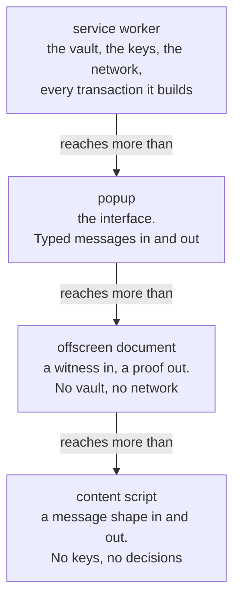

Four contexts, and each one can reach strictly less than the one before it.

## The extension id is not a boundary

`sender.id === chrome.runtime.id` does **not** mean "this came from the wallet".

A content script runs inside a hostile page's process and carries the extension's id. So that check alone would let anything a page can get the relay to forward reach the wallet router.

The actual boundary is the sender's **URL**: an extension page is one served from the extension's own origin, which a content script's never is.

Three consequences:

| | |
| --- | --- |
| The wallet router | reachable only from the extension's own pages |
| The SEP-43 handler | reachable from a content script, and can do only what that handler allows |
| The keep-warm port | held only by the extension's own pages, so a content script cannot keep the worker alive |

## The offscreen document checks its own sender

The most sensitive message in the system arrives there: a solved witness, which for a transfer or a withdrawal contains the spending key, the amount and the blinding.

The service worker checks its sender, so the offscreen document checks its own rather than resting on the fact that nothing else currently listens.

It also validates the request beyond the channel tag. The tag says who a message is for, not that it is well formed, so a request missing its bytecode is refused by name instead of reaching a decoder as `undefined` and failing opaquely inside the queue.

## The session mirror is pinned to trusted contexts

The data key that reopens the vault is mirrored into `chrome.storage.session` so the wallet survives worker eviction.

That store is explicitly pinned to trusted extension contexts, so a content script running inside a web page cannot read it. The default is the same; setting it makes the intent checkable.

The **seed is never mirrored**. Only the data key and a deadline.

## The private pocket is unreachable from a website

Three independent things hold this, and the ordering is deliberate.

<Steps>

<Step>
### A confidential operation needs a proof

Every state-changing confidential operation requires a valid UltraHonk proof over the account's own viewing key. A website cannot produce one, because it does not have the key and cannot get it.

This is the strongest of the three, because it does not depend on any code Pocket wrote.
</Step>

<Step>
### The contract-call allowlist

Every envelope a site asks to sign is decoded, and any contract invocation whose function is not explicitly allowed is refused.

The allowlist is **empty by default**. A denylist would fail open the moment a confidential operation is added to the contract; an allowlist means anything added tomorrow is out until somebody deliberately lets it in.

Non-invocation host functions are refused outright: the other two variants deploy code and upload wasm, neither of which has a consent screen or a reason to.
</Step>

<Step>
### Contract calls are not describable

A contract call's effect lives in arguments of arbitrary shape, so no approval screen can put it into words, so it never reaches one.

It is listed third because it would fall the day contract calls became describable, so it must never be the load-bearing one.
</Step>

</Steps>

The three are independent by design. Each holds on its own, and no two of them fail for the same reason.

## What the manifest grants

| Permission | Reaches |
| --- | --- |
| `storage` | the encrypted vault and the opening store |
| `alarms` | the idle lock, which must survive worker eviction |
| `offscreen` | one isolated document for proving |
| `unlimitedStorage` | the opening store, which must never be evicted |

No `tabs`, no clipboard, no history, no bookmarks. Onboarding moves itself into a tab using APIs that need no `tabs` permission, and it reads none of the fields that permission would unlock.

Three hosts, and the mainnet one is path-scoped to a single read-only endpoint so that granting it cannot become a way to submit a mainnet transaction.

The content security policy pins scripts to the extension's own package plus the narrow WebAssembly exception the prover needs, and pins images to the package and data URIs. `unsafe-eval` is absent, and release gate 6 fails if it appears.

## Where each rule is enforced

A rule enforced in the interface is a rule anything calling the worker can go around. So the checks that decide whether money moves live in the worker:

| Rule | Enforced in |
| --- | --- |
| Can this account afford this? | the worker, before building |
| Is this address the right kind? | the worker |
| Is anything unresolved? | the worker, at build and again at submit |
| Are these the bytes that were reviewed? | the worker, from its own retained envelope |
| Is this deployment's verification key ours? | the worker, before proving |

The interface repeats several of them so a control can be disabled before you press it, which is a better experience and is not the guarantee.
